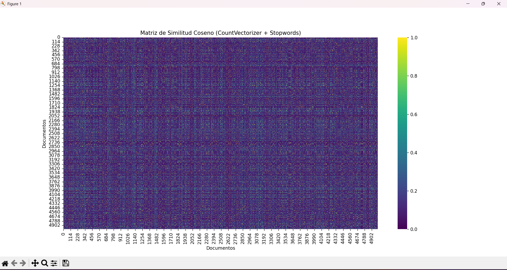
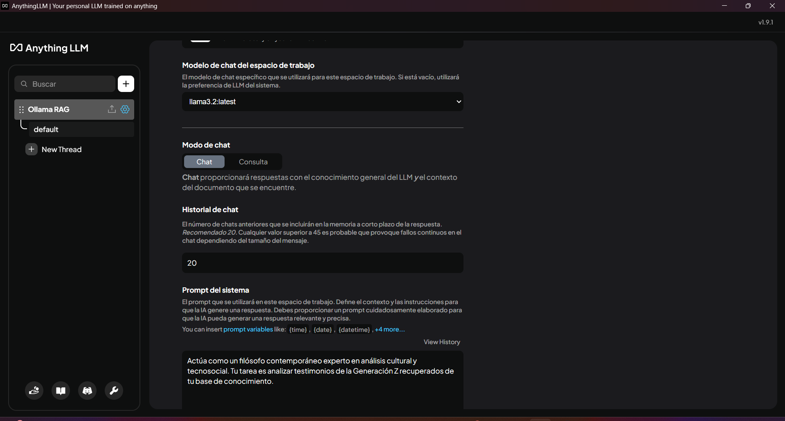

# INFORME

Se realizó una similitud coseno antes de empezar el proceso para hacerle una limpieza al webscrapping otorgado por el profesor al tener muchos comentarios repetidos y se reemplazaron por nuevos

## A. Eje: Crisis de Sentido y la "Sociedad del Cansancio"

**Evidencia del RAG:** El sistema identificó términos específicos como “vacío existencial”, “náusea” (desánimo), “sin sentido” y “scrolling infinito” para describir la experiencia de los usuarios en redes sociales. Las emociones predominantes detectadas fueron “ansiedad”, “agotamiento” y “desánimo”, los cuales van de acuerdo con la temática de la crisis de la sociedad.

**Análisis Filosófico (Sartre / Han):**

**Interpretación:** La aparición del término “náusea” conecta directamente con el existencialismo sartreano. No es solo angustia por la libertad, sino un agotamiento por el exceso de estímulos, los cuales podemos observar en redes sociales como TikTok, Instagram, con videos cortos generando demasiado estímulo para nuestro cerebro.

**Hallazgo:** El sistema detectó que la presión digital genera una “sensación de vacío interior” y “fatiga mental” por mantener una presencia constante. Esto valida la teoría de Byung-Chul Han: el sujeto se autoexplota creyendo que se realiza, lo que nos lleva a una “sociedad del cansancio” donde el scrolling actúa como un narcótico ante el vacío, haciendo posible el fenómeno del scrolling infinito en el cual el usuario busca estímulos constantes a lo largo del tiempo.

## B. Eje: Identidad Líquida y la Construcción Algorítmica

**Evidencia del RAG:** La identidad se describe con palabras como “efímero”, “transitorio” y “frágil”. Se usan metáforas como “mi identidad es un texto que está siendo escrito constantemente”. Además, se menciona una desconexión donde el “yo digital” es una entidad separada con sus propias necesidades.

**Análisis Filosófico (Bauman / Heidegger):**

**Interpretación:** La “identidad líquida” de Bauman se confirma empíricamente: la identidad no es fija, es un flujo susceptible de cambiar.

**Hallazgo:** Se observa el concepto de Gestell (estructura de emplazamiento) de Heidegger. La tecnología nos presenta al mundo (y a nosotros mismos) como recursos a ser optimizados. El sistema recuperó que la Gen Z siente que debe presentar una imagen idealizada, lo que genera una “falta de autenticidad”, sumado a los estándares imposibles de alcanzar y a una sensación de insuficiencia.

## C. Eje: Autonomía vs. Biopoder Digital

**Evidencia del RAG:** Existe una percepción generalizada de que la autonomía es algo “condicionado por la tecnología”. Los testimonios indican que “los algoritmos conocen mis gustos mejor que yo mismo” y que el usuario siente que “renuncia un poco más a su libertad de elección” con cada recomendación.

**Análisis Filosófico (Foucault / Habermas):**

**Interpretación:** Esto evidencia el biopoder de Foucault: el algoritmo normaliza comportamientos e intereses. El usuario es disciplinado no por castigo, sino por la predicción de sus deseos.

**Hallazgo:** Respecto a Habermas, los datos muestran una “creciente polarización” y la creación de “burbujas virtuales”, lo que confirma el debilitamiento del espacio público digital y la pérdida del pensamiento crítico.

## Conclusiones

- **Conclusión 1: La externalización del yo.** Los datos contradicen la noción de autonomía completa en la Gen Z. El hecho de que se perciba que “un algoritmo es el que moldea tus deseos” sugiere que la construcción de la identidad se ha delegado a procesos externos. El “yo” ya no es una certeza interna, sino una construcción dada por algoritmos externos de apps como redes sociales.

- **Conclusión 2: La paradoja de la hiperconectividad.** Aunque la tecnología promete conexión, el sistema RAG revela que genera “soledad” y “aislamiento”, “náuseas” y demás sentimientos negativos. La hiperconectividad facilita una “comparación constante” que deriva en sentimientos de insuficiencia.

- **Conclusión 3: Fatalismo algorítmico.** Existe una visión pesimista del futuro: el 42% cree que el mundo está peor. Los usuarios perciben que la tecnología “controla su comportamiento” y sienten una “pérdida de control sobre su vida”. Esto indica una resignación ante el determinismo tecnológico: se acepta la manipulación a cambio de la comodidad digital.

## Proceso de elaboración del sistema RAG

Se utilizó un dataset con 5,000 registros proporcionado por el profesor, los cuales hablaban de las opiniones y lo que siente la "Generación Z" en el país de México y su situación actual, los cuales fueron cargados en el programa LLM Everything para la elaboración de un sistema RAG. Dicho dataset, al cargarse en Everything LLM, fue embebido para un mejor funcionamiento del mismo.

Por su contraparte, se subió otro archivo en formato CSV mucho más chico con alrededor de 11 registros, los cuales eran los enfoques filosóficos dados por el profesor para que de esta manera pudiera responder correctamente orientado a estos mismos, indicando la manera y la forma en la cual debía responder el sistema.

## Evidencias

